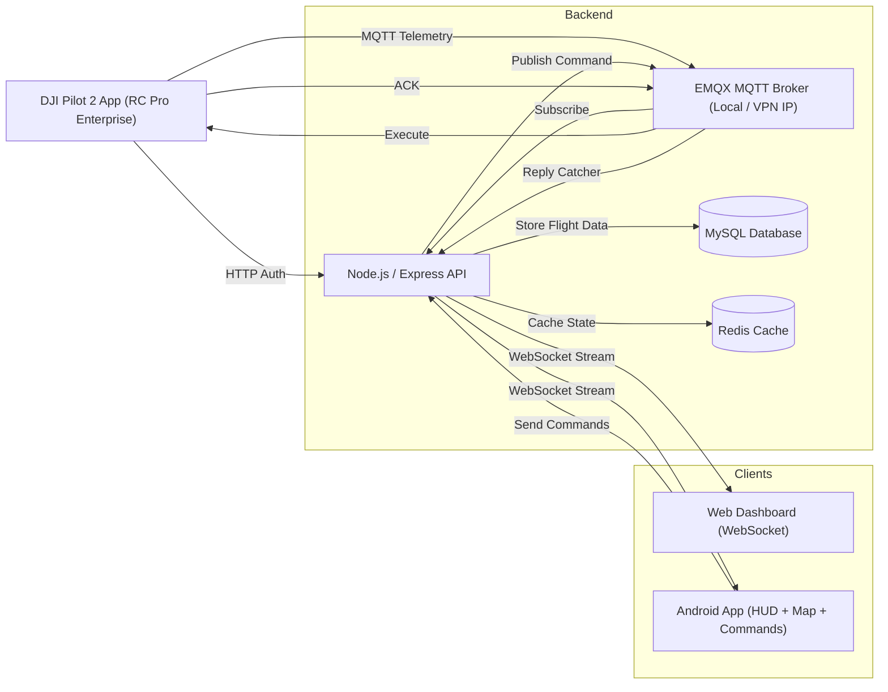

#  DJI Cloud API Telemetry & Control System

A full-stack, near real-time telemetry tracking and flight command system built for DJI Enterprise drones. This project leverages the **DJI Cloud API** to stream live drone data to a custom Node.js backend via MQTT, persists flight history in a MySQL database, and visualizes the data across a Web Dashboard and a native Android application.

**Current Project Status: 92% Complete** *The "Core Loop" (Connect → Monitor Telemetry → Send Command → Confirm Action) is fully stabilized, secured, and validated on real hardware.*

---

## ✨ Features & Functionality

### 1. Live Telemetry Dashboard
* **Real-Time Data:** Streams Battery %, Altitude (handles both Relative Height and Sea-Level ASL), Speed (Horizontal & Vertical), and Satellite count at 5Hz–10Hz (effectively real-time, ~100–200 ms latency).
* **Target Filtering:** Actively filters WebSocket streams by Aircraft Serial Number, ensuring accurate data mapping without RC controller mix-ups.
* **Flight Mode Translation:** Automatically translates raw DJI mode codes into readable text (e.g., "STANDBY", "MANUAL FLIGHT").

### 2. Interactive Map & Navigation (OSMDroid)
* **Live Tracking:** Automatically centers the map on the drone's coordinates with a custom marker.
* **Waypoint Planning:** Users can tap the map to drop waypoint markers, draw connecting green polylines, and clear the route. *(Note: UI planning is complete; execution payload transmission is pending).*

### 3. Flight Commands & Control
* **Secure Execution:** Commands are sent from the Mobile App via HTTP POST (secured by JWT), processed by the Node.js backend, and published to the drone via MQTT.
* **Working Commands:** * **Takeoff, Land, & RTH (Return to Home):** Fully implemented and tested.
  * **Take Photo ("Force & Shoot"):** Handles complex command sequencing (executing `camera_mode_switch` before `camera_photo_take`) in ~1500 ms. Simple commands execute in <500 ms.
* **Failure Handling:** Backend successfully catches "Drone Offline" scenarios, acknowledging API requests while safely handling missing drone responses.

### 4. System Utilities & Authentication
* **Data Export:** Built-in capability to dump flight history into a local CSV file on the Android device.
* **System Logging:** Real-time terminal UI inside the Android app to track network events, API calls, and errors.
* **Security:** Full Login/Logout flow utilizing JWT for mobile clients and dedicated credentials (`pilot2`) for the MQTT broker.

---

##  System Architecture

1. **DJI Pilot 2 App (RC Pro Enterprise):** Connects to the backend via HTTP to authenticate, then opens an MQTT stream to broadcast real-time telemetry.
2. **Backend (Node.js & Docker):**
   * **EMQX (Local-Cloud Hybrid):** Acts as the MQTT Broker handling high-frequency telemetry on a local/VPN IP.
   * **Node.js/Express:** Parses MQTT payloads, handles REST API commands, manages the "Reply Catcher" for drone acknowledgments, and serves WebSockets.
   * **MySQL:** Stores finalized flight summaries for historical tracking.
   * **Redis:** Caches temporary connection states.
3. **Frontend Clients:**
   * **Web Dashboard:** Connects via WebSocket for real-time graphs and live readouts.
   * **Android App:** Connects via WebSocket for a live HUD, OSMDroid map, and command execution.

---


## 🔑 How to Get & Configure Your DJI App Key

To allow your backend to communicate securely with the DJI drone, you must provide official DJI Developer credentials. 

### Step 1: Obtain the Credentials (Free)
1. Go to the [DJI Developer Portal](https://developer.dji.com/) and create a free account.
2. Click on your profile in the top right and go to the **Developer Center**.
3. On the left sidebar, click **Apps**.
4. Click the **Create App** button.
5. Choose **Cloud API** (or Mobile SDK if required by your specific DJI firmware) as the App Type.
6. Give your app a name (e.g., "DJI Cloud Project") and enter your Android Package Name (e.g., `com.yourname.djicloud`).
7. Once created, DJI will generate an **App ID** and an **App Key** for you. Keep this tab open.

## Step 2: Add Them to Your Project
Your backend Docker environment looks for these keys inside a hidden `.env` file. 

1. Open your code editor and navigate to the `backend/` folder.
2. Create a new file and name it exactly: `.env`
3. Paste the following template into the file and replace the empty spaces with the keys you just got from DJI:

```env
# --- DJI Credentials ---
DJI_APP_ID=paste_your_app_id_here
DJI_APP_KEY=paste_your_app_key_here
DJI_LICENSE=paste_your_license_here_if_applicable

# --- MQTT Broker Credentials ---
MQTT_USERNAME=pilot2
MQTT_PASSWORD=pilot2pass

# --- MySQL Database Credentials ---
MYSQL_ROOT_PASSWORD=rootpass
MYSQL_DATABASE=dji_cloud
MYSQL_USER=dji
MYSQL_PASSWORD=djipass
```

**Getting Started****
## Part 1: Start the Backend (Docker)
- Find your computer's local IP address (e.g., 192.168.1.X or 172.20.10.X).
- Open a terminal, navigate to the backend folder, and start the Docker containers:
 Bash
 cd backend
 docker compose up -d --build
- Verify the containers are running (emqx, mysql, redis, and cloud-backend):
 Bash
 docker ps
## Part 2: Connect the DJI Drone
- Turn on your DJI RC Pro Enterprise.
- Ensure it is connected to the same network as your backend.
- Open the DJI Pilot 2 App > Profile > Settings > Cloud Service.
- Select Other Platforms and enter your backend URL: http://<YOUR_LOCAL_IP>:6789/pilot-login
- Tap Connect. Return to the Flight View—the cloud icon should turn green.

## Part 3: Run the Android App
- Open Android Studio and load the android/ project folder.
  Important: Update the WebSocket and REST API URLs in the source code to match your backend's local IP address.
- Click Run to deploy the app to your emulator or physical Android device.

## Validation & Testing
- Hardware: Fully tested and validated using a physical DJI Matrice 30 (M30) Enterprise drone and DJI RC Pro Enterprise controller.
- Telemetry Latency: ~100–200 ms.
- Command Latency: <500 ms for simple actions; ~1500 ms for sequenced commands.

## Roadmap (The Final 8%)
- Media Gallery: Implement persistent gallery viewing (fetching photos directly into the app via S3/MinIO).
- Waypoint Execution: Connect the existing UI drawn paths to the drone's KMZ/WPML mission execution endpoint.

## Troubleshooting
- Red Exclamation Mark on DJI App: * Check if your computer's local IP address changed.
- Disable macOS/Windows firewalls temporarily (Port 1883 may be blocked).
- Clear the DJI Pilot 2 App cache: Force close the app, unbind the platform, and reconnect from scratch.
- MQTT Authentication Fails: Check the EMQX Dashboard (http://localhost:18083) under Access Control > Authentication to ensure the drone's username/password match your .env configuration.
